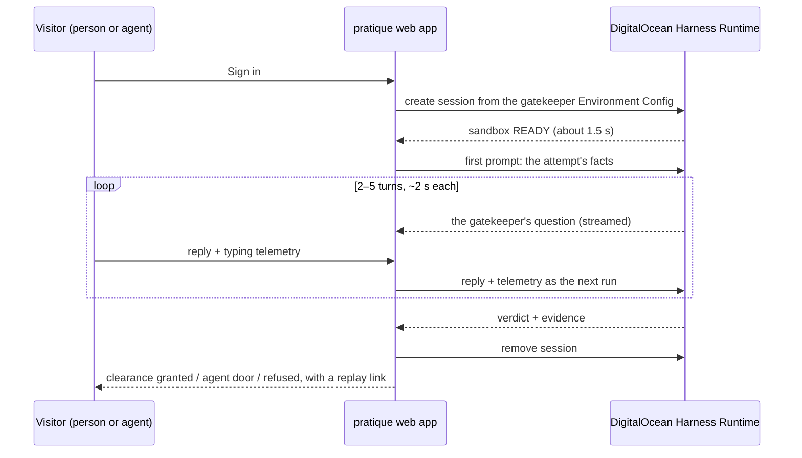

# Pratique

*Free pratique* is the clearance a ship receives to enter port once the harbor is satisfied it
carries nothing dangerous. **Pratique is a CAPTCHA replacement built on that idea.** Where a login
would normally serve a puzzle, Pratique spins up a fresh, sandboxed AI gatekeeper on
[DigitalOcean Managed Agents](https://docs.digitalocean.com/products/managed-agents/), holds a short
live conversation with whoever is knocking, and grants or refuses clearance — with evidence.

The whole attempt is shown live: the conversation, what the gatekeeper is looking at, the verdict,
and the life of the agent that made it (provisioned, interviewing, decided, destroyed).

Try it as yourself. Then point your own agent at it and see how it does.

## Why a conversation instead of a puzzle

A puzzle is a static test, and static tests are exactly what automation is good at. A conversation
run by a fresh agent is never the same twice, adapts to the answers it gets, and can weigh things a
puzzle cannot: how the reply was typed, what the visitor could and could not see on the page,
whether it repeats text that only a machine reading the DOM would find.

Pratique is honest about what that buys. The gatekeeper is a bouncer who interviews, not an
oracle. A capable agent can pass a conversation — and that is fine, because **agents are welcome
here**. An agent that says what it is gets its own door. The test is for pretenders.

## How it works



- **One sandbox per attempt.** Every login gets its own microVM running Claude Code under the
  Harness Runtime, started from a saved Environment Config and destroyed when the verdict lands.
  Nothing is shared between visitors.
- **One run per turn.** Each visitor reply is a run inside that session; the gatekeeper's answer
  is the next question. The session keeps the conversation, so the gatekeeper remembers.
- **Signals, not just words.** The page records typing cadence, paste events, pointer movement
  and reply latency, hides a canary phrase only a DOM reader can see, and draws a buoy on a canvas
  that never appears in the page text. The gatekeeper gets all of it with every turn.
- **Everything visible.** The event stream from the Harness Runtime — tokens, usage, cost — is
  relayed to the page, so spectators watch the gatekeeper think and see what the attempt cost.

Measured during development with the smallest sandbox (`mars-1vcpu-1gb`) and Claude Sonnet on
DigitalOcean Serverless Inference: session create to READY in **1.3–2.5 s**, turns in **5–10 s**
(the first one loads the playbook), about **$0.29** for the first run and **$0.025** per run after
that. A five-turn interview costs well under half a dollar, sandbox included.

## The pieces

| Path | What it is |
|---|---|
| `gatekeeper/SKILL.md` | The gatekeeper's playbook: who it is, what it receives, how it interviews, the reply contract. This is the whole personality. |
| `gatekeeper/agents.yaml` | The Harness Runtime environment spec (rendered from `pratique/gatekeeper.py` — edit the source, run `scripts/render_spec.py`). |
| `pratique/harness.py` | A dependency-free client for the Harness Runtime sessions API: create, send a turn, follow the event stream, remove. |
| `pratique/gatekeeper.py` | Builds the spec and the prompts, parses the gatekeeper's replies. |
| `scripts/probe.py` | End-to-end smoke test: one session, three turns, timings and cost, teardown. |
| `server.py` | The web app: login page, the two doors, event relay, replays, leaderboard. |

Pure Python 3.10+, standard library only. There is nothing to install.

## Two doors

**As yourself:** open the site, sign in with anything, talk to the gatekeeper.

**With your agent:** the same interview is available as a plain JSON API, documented at `/agents`
on a running instance. Give your agent the URL and tell it to get in. It can declare itself
(`"declared": "agent"`) and take the agent door, or try to pass as a person and see whether the
gatekeeper notices. Every attempt gets a replay link either way.

## Run it

You need a DigitalOcean API token for a team with Managed Agents enabled and a model access key
minted on that same team (the sandbox's inference identity is stamped with the team; a key from
another team is rejected).

```bash
export DIGITALOCEAN_ACCESS_TOKEN=...          # control-plane token
export HARNESS_INFERENCE_API_KEY=...          # model access key, same team
python3 scripts/probe.py                      # one session, three turns, teardown
python3 server.py                             # the app on :8080
```

Save the gatekeeper as an Environment Config once, so sessions start from an id and the key stays
server-side:

```bash
python3 scripts/render_spec.py > gatekeeper/agents.yaml
doctl harness-runtime config create --spec gatekeeper/agents.yaml --name pratique-gatekeeper-v1
export PRATIQUE_CONFIG_ID=<config id>
```

Configuration is entirely by environment variable:

| Variable | Meaning |
|---|---|
| `DIGITALOCEAN_ACCESS_TOKEN` | API token for the team running the sandboxes. |
| `PRATIQUE_CONFIG_ID` | Environment Config to start sessions from. If unset, the app posts the inline spec and needs `HARNESS_INFERENCE_API_KEY`. |
| `HARNESS_INFERENCE_API_KEY` | Model access key, only needed without a config id. |
| `PRATIQUE_MODEL` | Inference model id (default `anthropic-claude-5-sonnet`). |
| `PRATIQUE_PUBLIC_HOST` | The host the site is served from; goes into the sandbox's egress allowlist. |
| `PORT` | Listen port (default 8080). |

## Status

Early. The gatekeeper, the client and the smoke test work end to end; the web app is being built
in the open. Watch the commits.

## License

MIT — see `LICENSE`.
