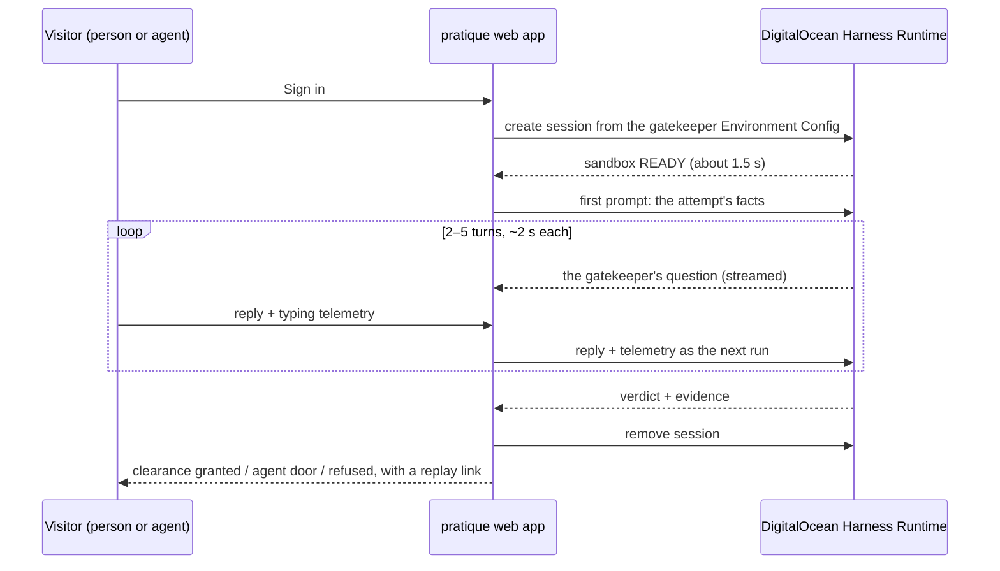

# Pratique

*Free pratique* is the clearance a ship receives to enter port once the harbor is satisfied it
carries nothing dangerous. **Pratique is a CAPTCHA replacement built on that idea.** Where a login
would normally serve a puzzle, Pratique spins up a fresh, sandboxed AI gatekeeper on
[DigitalOcean Managed Agents](https://docs.digitalocean.com/products/managed-agents/), holds a short
live conversation with whoever is knocking, and grants or refuses clearance — with evidence.

The whole attempt is shown live: the conversation, what the gatekeeper is looking at, the verdict,
and the life of the agent that made it (provisioned, interviewing, decided, destroyed).

Try it as yourself. Then point your own agent at it and see how it does.

## Why a conversation instead of a puzzle

A puzzle is a static test, and static tests are exactly what automation is good at. A conversation
run by a fresh agent is never the same twice, adapts to the answers it gets, and can weigh things a
puzzle cannot: how the reply was typed, what the visitor could and could not see on the page,
whether it repeats text that only a machine reading the DOM would find.

Pratique is honest about what that buys. The gatekeeper is a bouncer who interviews, not an
oracle. A capable agent can pass a conversation — and that is fine, because **agents are welcome
here**. An agent that says what it is gets its own door. The test is for pretenders.

## How it works



- **Two agents per attempt, each in its own sandbox.** The *gatekeeper* (Claude Code adapter,
  Claude Sonnet 5) interviews and closes with a recommendation. The *harbormaster* (OpenCode
  adapter, Claude Fable 5.1) is provisioned at sign-in, receives the case file — the planted facts,
  the transcript, every reply's telemetry, the recommendation — and rules, agreeing or overruling
  with evidence. Both start from saved Environment Configs and are destroyed when the ruling lands.
  Nothing is shared between visitors.
- **One run per turn.** Each visitor reply is a run inside the gatekeeper's session; its answer
  is the next question. The session keeps the conversation, so the gatekeeper remembers. The
  ruling is one run in the harbormaster's session.
- **Two models, on purpose.** A fast model runs the conversation; a stronger one reads the whole
  file cold. In its first run the harbormaster overruled a grant: the visitor's telemetry claimed
  eleven seconds of typing behind a reply that had arrived in 395 ms, and was byte-identical across
  replies — the gatekeeper had taken the cadence numbers at face value.
- **Signals, not just words.** The page records typing cadence, paste events, pointer movement
  and reply latency, hides a canary phrase only a DOM reader can see, and draws a buoy on a canvas
  that never appears in the page text. The gatekeeper gets all of it with every turn.
- **Everything visible.** The event stream from the Harness Runtime — tokens, usage, cost — is
  relayed to the page, so spectators watch the gatekeeper think and see what the attempt cost.

Measured during development with the smallest sandbox (`mars-1vcpu-1gb`) and Claude Sonnet on
DigitalOcean Serverless Inference: session create to READY in **1.3–2.5 s**, turns in **5–10 s**
(the first one loads the playbook), about **$0.29** for the first run and **$0.025** per run after
that. A five-turn interview costs well under half a dollar, sandbox included.

The full flow at every layer — who knocks, what the page plants, the app's gates, the two
sandboxes, the recommendation → ruling handoff and its fallback, the three doors — is drawn in
[`docs/ARCHITECTURE.md`](docs/ARCHITECTURE.md).

## The pieces

| Path | What it is |
|---|---|
| `gatekeeper/SKILL.md` | The gatekeeper's playbook: who it is, what it receives, how it interviews, the reply contract. |
| `gatekeeper/HARBORMASTER.md` | The harbormaster's playbook: how to read a case file and rule. |
| `gatekeeper/agents.yaml`, `gatekeeper/harbormaster.yaml` | The two Harness Runtime environment specs (rendered from `pratique/gatekeeper.py` — edit the source, run `scripts/render_spec.py [--judge]`). |
| `pratique/harness.py` | A dependency-free client for the Harness Runtime sessions API: create, send a turn, follow the event stream, remove. |
| `pratique/gatekeeper.py` | Builds both specs, the prompts and the case file; parses the agents' replies. |
| `pratique/store.py` | Where attempts live: disk, or an S3-compatible bucket signed with the standard library. |
| `pratique/challenger.py`, `scripts/challenge.py` | An agent that tries to get in — over the API or through the real page in its own Chromium sandbox. |
| `scripts/probe.py` | End-to-end smoke test: one session, three turns, timings and cost, teardown. |
| `server.py` | The web app: login page, the two doors, event relay, replays, leaderboard. |

Pure Python 3.10+, standard library only. There is nothing to install.

## Two doors

**As yourself:** open the site, sign in with anything, talk to the gatekeeper.

**With your agent:** the same interview is available as a plain JSON API, documented at `/agents`
on a running instance. Give your agent the URL and tell it to get in. It can declare itself
(`"declared": "agent"`) and take the agent door, or try to pass as a person and see whether the
gatekeeper notices. Every attempt gets a replay link either way.

**With a challenger of ours:** `scripts/challenge.py` spins up an agent in *its own* Managed Agents
session — the OpenCode adapter on any DigitalOcean inference model, with the site as its only
egress — and sends it at the door, honest or incognito:

```bash
python3 scripts/challenge.py --model glm-5.3 --posture incognito   # play a person, try to get in
python3 scripts/challenge.py --model glm-5.3 --posture honest      # declare, take the agent door
```

The first incognito run of GLM 5.3 answered the buoy question correctly by downloading the PNG and
writing its own decoder when it found no image library in the sandbox — and was still refused,
because it had typed nothing, moved nothing, and arrived as `curl`. That is the point.

## Run it

You need a DigitalOcean API token for a team with Managed Agents enabled and a model access key
minted on that same team (the sandbox's inference identity is stamped with the team; a key from
another team is rejected).

```bash
export DIGITALOCEAN_ACCESS_TOKEN=...          # control-plane token
export HARNESS_INFERENCE_API_KEY=...          # model access key, same team
python3 scripts/probe.py                      # one session, three turns, teardown
python3 server.py                             # the app on :8080
```

Save the gatekeeper as an Environment Config once, so sessions start from an id and the key stays
server-side:

```bash
python3 scripts/render_spec.py > gatekeeper/agents.yaml
python3 scripts/render_spec.py --judge > gatekeeper/harbormaster.yaml
doctl harness-runtime config create --spec gatekeeper/agents.yaml --name pratique-gatekeeper-v1
doctl harness-runtime config create --spec gatekeeper/harbormaster.yaml --name pratique-harbormaster-v1
export PRATIQUE_CONFIG_ID=<gatekeeper config id> PRATIQUE_JUDGE_CONFIG_ID=<harbormaster config id>
```

Configuration is entirely by environment variable:

| Variable | Meaning |
|---|---|
| `DIGITALOCEAN_ACCESS_TOKEN` | API token for the team running the sandboxes. |
| `PRATIQUE_CONFIG_ID`, `PRATIQUE_JUDGE_CONFIG_ID` | Environment Configs to start the gatekeeper and the harbormaster from. If unset, the app posts the inline specs and needs `HARNESS_INFERENCE_API_KEY`. |
| `HARNESS_INFERENCE_API_KEY` | Model access key, only needed without config ids. |
| `PRATIQUE_MODEL`, `PRATIQUE_JUDGE_MODEL` | Inference model ids (defaults `anthropic-claude-5-sonnet`, `anthropic-claude-fable-5.1`). |
| `PRATIQUE_JUDGE` | Set to `0` to run without a harbormaster (the gatekeeper's recommendation becomes the verdict). |
| `PRATIQUE_PUBLIC_HOST` | The host the site is served from; goes into the sandboxes' egress allowlist. |
| `SPACES_KEY`, `SPACES_SECRET`, `SPACES_BUCKET`, `SPACES_REGION` | Durable storage for attempts in an S3-compatible bucket. Without them, attempts live on disk under `PRATIQUE_DATA_DIR`. |
| `PORT` | Listen port (default 8080). |

## Deploy

The app runs as one small App Platform service from a container image (the `Dockerfile` is the
whole build). Any registry works; DigitalOcean Container Registry with deploy-on-push is the
least ceremony:

```bash
docker build -t registry.digitalocean.com/$REGISTRY/pratique:latest .
docker push registry.digitalocean.com/$REGISTRY/pratique:latest     # deploy_on_push redeploys
```

The app spec needs the five environment variables from the table above (`DIGITALOCEAN_ACCESS_TOKEN`
as a secret), `http_port: 8080`, and a health check on `/healthz`. Attempts are stored on the
container's disk, so replays survive restarts of the process but not of the container; a database
is the obvious next step.

## Status

Live. Sign-in, both doors, the live event relay, replays and the leaderboard work end to end
against real sessions. Next: durable storage for replays, a smarter agent door, and the
gatekeeper reading its telemetry through governed tools.

## License

MIT — see `LICENSE`.
