# Pratique — architecture

The whole flow, from a visitor's first click to a door opening or staying shut, at every layer.
Rendered by GitHub; the source is plain Mermaid.

```mermaid
flowchart LR
  subgraph V["1 · Who knocks"]
    H["Person<br/>in a browser"]
    A2["Agent driving Chromium<br/>in its own Managed Agents sandbox<br/>(campaign: one harness per model, 3 personas)"]
    A1["Agent over<br/>the JSON API"]
  end

  subgraph P["2 · The page plants evidence and records"]
    L["Login card<br/>any credentials · handle<br/>'I am an agent' checkbox"]
    T["Telemetry<br/>keydown timing · gap spread<br/>backspaces · pastes · time to first key<br/>pointer path · focus loss"]
    C["Canary line<br/>off-screen text only<br/>a DOM reader sees"]
    B["Buoy PNG<br/>color only in the pixels"]
  end

  subgraph W["3 · pratique app — App Platform"]
    G{"throttles<br/>40 / address / 10 min<br/>12 live attempts"}
    NEW["create attempt<br/>facts: declared · canary word · buoy color<br/>provision both sandboxes in parallel"]
    LOOP["interview loop<br/>one run per reply<br/>adds reply latency · client · canary repeated?"]
    CASE["case file<br/>facts · transcript<br/>every reply's telemetry · recommendation"]
    FALL{"harbormaster<br/>ruled?"}
    DOOR{"door"}
  end

  subgraph M["4 · DigitalOcean Managed Agents — Harness Runtime"]
    GK["Gatekeeper sandbox<br/>Claude Code adapter · Claude Sonnet 5<br/>interview playbook · permissions: deny"]
    GQ{"enough<br/>evidence?"}
    HM["Harbormaster sandbox<br/>OpenCode adapter · Claude Fable 5.1<br/>ruling playbook"]
    INF["Serverless Inference<br/>team-stamped model key"]
  end

  subgraph O["5 · Doors"]
    OK["GRANTED<br/>free pratique"]
    AD["AGENT DOOR<br/>declared, welcome"]
    NO["REFUSED<br/>pretender · undecided · abandoned"]
    ST["Spaces bucket<br/>replay /a/id · leaderboard"]
  end

  H --> L
  A2 --> L
  A1 -.->|"no page: no telemetry, client = curl"| G
  L --> G
  G -->|"429 / 503"| NO
  G -->|ok| NEW
  NEW -->|"first prompt: the facts"| LOOP
  NEW --> HM
  T -->|"reply + telemetry"| LOOP
  C -.->|"repeated back?"| LOOP
  B -.->|"named correctly?"| LOOP
  LOOP <-->|"question ⇄ reply, one run each"| GK
  GK --> GQ
  GQ -->|"no: ask again, max 6"| LOOP
  GQ -->|"recommendation<br/>kind · door · confidence · evidence"| CASE
  LOOP -->|"silent 7 min: abandoned"| NO
  CASE -->|"one run"| HM
  HM -->|"verdict: agrees or overrules"| FALL
  FALL -->|"yes: the ruling"| DOOR
  FALL -->|"no: recommendation stands"| DOOR
  DOOR -->|human| OK
  DOOR -->|"declared agent"| AD
  DOOR -->|"pretender · undecided"| NO
  OK -->|"both sandboxes destroyed"| ST
  AD --> ST
  NO --> ST
  GK -.-> INF
  HM -.-> INF
```

## Reading it

- **Three ways in, three doors out.** People and browser-driving agents come through the page and
  are measured by it; API agents skip the page and arrive with no telemetry at all, which the
  harbormaster reads as a fact, not a crime. Out: granted, the agent door, or refused.
- **The page plants evidence.** The canary is text only a DOM reader sees; the buoy's color is only
  in pixels; the collector records how a reply was typed, never what was typed. The app adds what
  only it can measure: how long the reply took, what client sent it, whether the canary came back.
- **Two agents, two models, one attempt.** The gatekeeper runs the conversation on a fast model and
  ends with a recommendation. The harbormaster, provisioned at sign-in so it is warm, reads the
  whole case file cold on a stronger model and rules — it may overrule. If it cannot rule, the
  recommendation stands rather than the visitor waiting.
- **Nothing outlives the attempt but the record.** Both sandboxes are destroyed at the ruling;
  the attempt JSON goes to a bucket, which is what the replay page and the leaderboard read.
